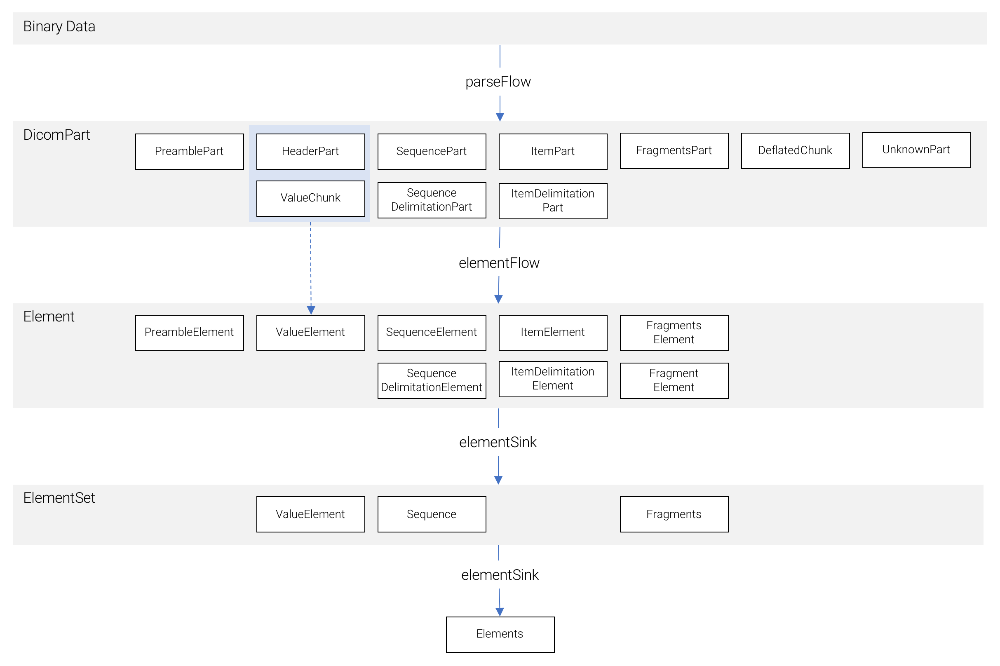

# dicom-streams-js

[](https://travis-ci.org/exini/dicom-streams-js)
[](https://coveralls.io/r/exini/dicom-streams-js)

The purpose of this project is to create a streaming API for reading and processing DICOM data using [node-streams](https://nodejs.org/api/stream.html). It can be used both on the backend using Node, as well as on the frontend. Advantages of streaming DICOM data include better control over resource allocation such as memory via strict bounds on DICOM data chunk size and network utilization using back-pressure.

This project is a port of the [dicom-streams](https://github.com/exini/dicom-streams) project which is written in Scala using Akka-streams.

### Setup

The dicom-streams-js library is deployed to NPM. Install it using `npm install -s @exini/dicom-streams-js`. Time and date handling using `js-joda` is marked as an external dependency in dicom-streams-js. If you want to read and modify times and dates, install this using `npm install -s js-joda`.

### Data Model

Streaming binary DICOM data may originate from many different sources such as files, a HTTP POST request (on the server side), or a read from a database. Streaming data arrives in chunks (`Buffer`s). In the Node Streams nomenclature, chunks originate from _readables_, they are processed in _transforms_ and and folded into a non-streaming plain objects using _writables_. Synonyms for these terms are _sources_, _flows_ and _sinks_. These latter terms are used in the docs and throughout the code.

This library provides flows for parsing binary DICOM data into DICOM parts (represented by the `DicomPart` abstraction) - small objects representing a part of a data element. These DICOM parts are bounded in size by a user specified chunk size parameter. Flows of DICOM parts can be processed using a series of flows in this library. There are flows for filtering based on tag path conditions, flows for converting between transfer syntaxes, flows for re-encoding sequences and items, etc. 

The `Element` interface provides a set of higher level data classes, each roughly corresponding to one row in a textual dump of a DICOM files. Here, chunks are aggregated into complete data elements. There are representations for standard tag-value elements, sequence and item start elements, sequence and item delimitation elements, fragments start elements, etc. A `DicomPart` stream is transformed into an `Element` stream via the `elementFlow` flow.

A flow of `Element`s can be materialized into a representation of a dataset called an `Elements` using the `elementSink` sink. For processing of large sets of data, one should strive for a fully streaming DICOM pipeline, however, in some cases it can be convenient to work with a plain dataset; `Elements` serves this purpose. Internally, the sink aggregates
`Element`s into `ElementSet`s, each with an asssociated tag number (value elements, sequences and fragments). `Elements` implements a straight-forward data hierarchy:
* An `Elements` holds a list of `ElementSet`s (`ValueElement`, `Sequence` and `Fragments`)
* A `ValueElement` is a standard attribute with tag number and binary value
* A `Sequence` holds a list of `Item`s
  * An `Item` contains zero or one `Elements` (note the recursion)
* A `Fragments` holds a list of `Fragment`s
  * A `Fragment` holds a binary value. 

The following diagram shows an overview of the data model at the `DicomPart`, `Element` and `ElementSet` levels.



As seen, a standard attribute, represented by the `ValueElement` class is composed by one `HeaderPart` followed by zero,
one or more `ValueChunk`s of data. Likewise, ecapsulated data such as a jpeg image is composed by one `FragmentsPart`
followed by, for each fragment, one `ItemPart` followed by `ValueChunk`s of data, and ends with a
`SequenceDelimitationPart`.

### Examples

The following example reads the DICOM file provided as input argument, folds its contents first into a stream of `Element`s, and then into a concrete `Elements` object and logs the result to the console

```javascript
const fs = require("fs");
const {parseFlow, elementFlow, elementSink, pipe, VR} = require("@exini/dicom-streams-js");

const src = fs.createReadStream(process.argv[2]);

pipe(
    src,
    parseFlow(),
    elementFlow(),
    elementSink(elements => {
        console.log(elements.toString());
    })
);
```

The next, longer, example reads the file specified by the first input argument then passes the data through the following flows:
1. Parsing the binary data into `DicomPart`s for further processing
2. Re-encoding the data to always use indeterminate length sequences and items with explicit sequence and item delimitations
3. Re-encoding the data to use the UTF-8 character set
4. Filtering of the elements to preserve only those on a white list specified as an array of `TagTree`s (trees of pointers into a dataset) 
5. Filtering of the remaining elements according to a black list of tag trees
6. Modification of the remaining elements to set Patient Name to `Anon 001`, add or modifiy the attribute Patient Identity Removed to `YES`, and leave other elements unmodified
7. Map the resulting elements to their corresponding byte representations
8. Write the results to disk using the file name specified by the second input argument.

```javascript
const fs = require("fs");
const {
    TagPath, TagTree, parseFlow, toBytesFlow, whitelistFilter, blacklistFilter, toUtf8Flow, toIndeterminateLengthSequences,
    modifyFlow, TagModification, TagInsertion, pipe
} = require("@exini/dicom-streams-js");

const src = fs.createReadStream(process.argv[2]);
const dest = fs.createWriteStream(process.argv[3]);

pipe(
    src,
    parseFlow(),
    toIndeterminateLengthSequences(),
    toUtf8Flow(),
    whitelistFilter([
        TagTree.fromTag(Tag.SpecificCharacterSet),
        TagTree.fromTag(Tag.PatientName),
        TagTree.fromTag(Tag.PatientName),
        TagTree.fromTag(Tag.StudyDescription),
        TagTree.fromTag(Tag.SeriesDate),
        TagTree.fromAnyItem(Tag.MACParametersSequence)
    ]),
    blacklistFilter([
        TagTree.fromAnyItem(Tag.MACParametersSequence).thenTag(Tag.DataElementsSigned)
    ]),
    modifyFlow([
        TagModification.equals(TagPath.fromTag(Tag.PatientName), () => Buffer.from("Anon 001"))
    ], [
        new TagInsertion(TagPath.fromTag(Tag.PatientIdentityRemoved), () => Buffer.from("YES"))
    ]),
    toBytesFlow(),
    dest
);

```
### Custom Processing
New non-trivial DICOM flows can be built using a modular system of capabilities that are mixed in as appropriate with a core class implementing a common base interface. The base abstraction for DICOM flows is `DicomFlow` and new flows are created using the `DicomFlow.createFlow` method. The `DicomFlow` interface defines a series of events, one for each type of `DicomPart` that is produced when parsing DICOM data with `DicomParseFlow`. The core events are:
```javascript
  public onPreamble(part: PreamblePart): DicomPart[]
  public onHeader(part: HeaderPart): DicomPart[]
  public onValueChunk(part: ValueChunk): DicomPart[]
  public onSequence(part: SequencePart): DicomPart[]
  public onSequenceDelimitation(part: SequenceDelimitationPart): DicomPart[]
  public onFragments(part: FragmentsPart): DicomPart[]
  public onItem(part: ItemPart): DicomPart[]
  public onItemDelimitation(part: ItemDelimitationPart): DicomPart[]
  public onDeflatedChunk(part: DeflatedChunk): DicomPart[]
  public onUnknown(part: UnknownPart): DicomPart[]
  public onPart(part: DicomPart): DicomPart[]
```
Default behavior to these events are implemented in core classes. The most natural behavior is to simply pass parts on
down the stream, e.g. 
```javascript
  public onPreamble(part: PreamblePart): DicomPart[] { return [part]; }
  public onHeader(part: HeaderPart): DicomPart[] { return [part]; }
  ...
```
This behavior is implemented in the `IdentityFlow` core class. Another option is to defer handling to the `onPart` method which is implemented in the `DeferToPartFlow` core class. This is appropriate for flows which define a common behavior for all part types. 

To give an example of a custom flow, here is the implementation of a filter that removes nested sequences from a dataset. We define a nested dataset as a sequence with `depth > 1` given that the root dataset 
has `depth = 0`.
```javascript
  public nestedSequencesFilter() = createFlow(new class extends TagPathTracking(GuaranteedValueEvent(GuaranteedDelimitationEvents(InFragments(DeferToPartFlow)))) {
    public onPart(part: DicomPart): DicomPart[] { return this.tagPath.depth() > 1 ? [] : [part];
  }());
```
In this example, we chose to use `DeferToPartFlow` as the core class and mixed in the `TagPathTracking` capability (along with its dependencies `GuaranteedValueEvent`, `GuaranteedDelimitationEvents` and `InFragments`) which gives access to a `tagPath: TagPath` variable at all times which is automatically updated as the flow progresses.

### License

This project is released under the [Apache License, version 2.0](./LICENSE).
